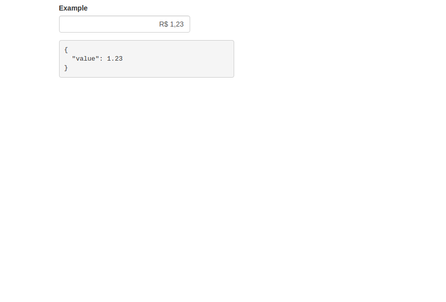

# AngularJS - Currency Input Component

Currency Input component is build in AngularJS, used for currency value input field for all countries. You can change prefix and sufix for input. Can also handle negative and positive values depending on requirement.

# Table of contents

- [Demo](#demo)
- [Getting started](#getting-started)
- [Quick fixes](#quick-fixes)
- [Want to Contribute?](#want-to-contribute)
- [Need Help / Support?](#need-help)
- [Collection of Other Components](#collection-of-components)
- [Changelog](#changelog)
- [Credits](#credits)
- [License](#license)
- [Keywords](#Keywords)

## Demo

[](https://github.com/weblineindia/AngularJS-Currency-Input/currencyDemo.png)

## Getting Started

### Installing and Importing

Install the package by command:

```sh
    npm install angular-weblineindia-currency-input --save
```

Import the module

```ts
import { NgxCurrencyModule } from "angular-weblineindia-currency-input";

@NgModule({
    imports: [
        ...
        NgxCurrencyModule
    ],
    declarations: [...],
    providers: [...]
})
export class AppModule {}
```

### Using

```html
<input currencyMask formControlName="value" />
```

- `ngModel` An attribute of type number. If is displayed `'$ 25.63'`, the attribute will be `'25.63'`.

### Options

You can set options...

```html
<!-- example for pt-BR money -->
<input
  currencyMask
  formControlName="value"
  [options]="{ prefix: 'R$ ', thousands: '.', decimal: ',' }"
/>
```

Available options:

- `align` - Text alignment in input. (default: `right`)
- `allowNegative` - If `true` can input negative values. (default: `true`)
- `decimal` - Separator of decimals (default: `'.'`)
- `precision` - Number of decimal places (default: `2`)
- `prefix` - Money prefix (default: `'$ '`)
- `suffix` - Money suffix (default: `''`)
- `thousands` - Separator of thousands (default: `','`)
- `nullable` - when true, the value of the clean field will be `null`, when false the value will be `0`
- `min` - The minimum value (default: `undefined`)
- `max` - The maximum value (default: `undefined`)
- `inputMode` - Determines how to handle numbers as the user types them (default: `FINANCIAL`)

Input Modes:

- `FINANCIAL` - Numbers start at the highest precision decimal. Typing a number shifts numbers left.
  The decimal character is ignored. Most cash registers work this way. For example:
  - Typing `'12'` results in `'0.12'`
  - Typing `'1234'` results in `'12.34'`
  - Typing `'1.234'` results in `'12.34'`
- `NATURAL` - Numbers start to the left of the decimal. Typing a number to the left of the decimal shifts
  numbers left; typing to the right of the decimal replaces the next number. Most text inputs
  and spreadsheets work this way. For example:
  - Typing `'1234'` results in `'1234'`
  - Typing `'1.234'` results in `'1.23'`
  - Typing `'12.34'` results in `'12.34'`
  - Typing `'123.4'` results in `'123.40'`

You can also set options globally...

```ts
import { CurrencyMaskInputMode, NgxCurrencyModule } from "angular-weblineindia-currency-input";

export const customCurrencyMaskConfig = {
    align: "right",
    allowNegative: true,
    allowZero: true,
    decimal: ",",
    precision: 2,
    prefix: "R$ ",
    suffix: "",
    thousands: ".",
    nullable: true,
    min: null,
    max: null,
    inputMode: CurrencyMaskInputMode.FINANCIAL
};

@NgModule({
    imports: [
        ...
        NgxCurrencyModule.forRoot(customCurrencyMaskConfig)
    ],
    declarations: [...],
    providers: [...],
    bootstrap: [AppComponent]
})
export class AppModule {}
```

## Quick fixes

### Ionic 2-3

Input not working on mobile keyboard

```html
<!-- Change the type to 'tel' -->
<input currencyMask type="tel" formControlName="value" />
```

Input focus get hide by the mobile keyboard

on HTML

```html
<!-- Change the type to 'tel' -->
<input
  currencyMask
  type="tel"
  formControlName="value"
  [id]="'yourInputId' + index"
  (focus)="scrollTo(index)"
/>
```

on .ts

```ts
import { Content } from 'ionic-angular';

export class...

    @ViewChild(Content) content: Content;

    scrollTo(index) {
        let yOffset = document.getElementById('yourInputId' + index).offsetTop;
        this.content.scrollTo(0, yOffset + 20);
    }
```

## Want to Contribute?

- Created something awesome, made this code better, added some functionality, or whatever (this is the hardest part).
- [Fork it](http://help.github.com/forking/).
- Create new branch to contribute your changes.
- Commit all your changes to your branch.
- Submit a [pull request](http://help.github.com/pull-requests/).

---

## Collection of Components

We have built many other components and free resources for software development in various programming languages. Kindly click here to view our [Free Resources for Software Development](https://www.weblineindia.com/software-development-resources.html).

---

## Changelog

Detailed changes for each release are documented in [CHANGELOG.md](./CHANGELOG.md).

## Credits

angular-weblineindia-currency-input is inspired by [ngx-currency](https://www.npmjs.com/package/ngx-currency).

## License

[MIT](LICENSE)

[mit]: https://github.com/weblineindia/AngularJS-Currency-Input/blob/master/LICENSE

## Keywords

angularjs-currency, angular-currency-input, angular-input-component, angularjs-input-field, input-field, currency-input
